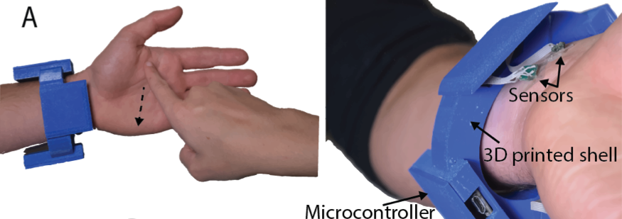
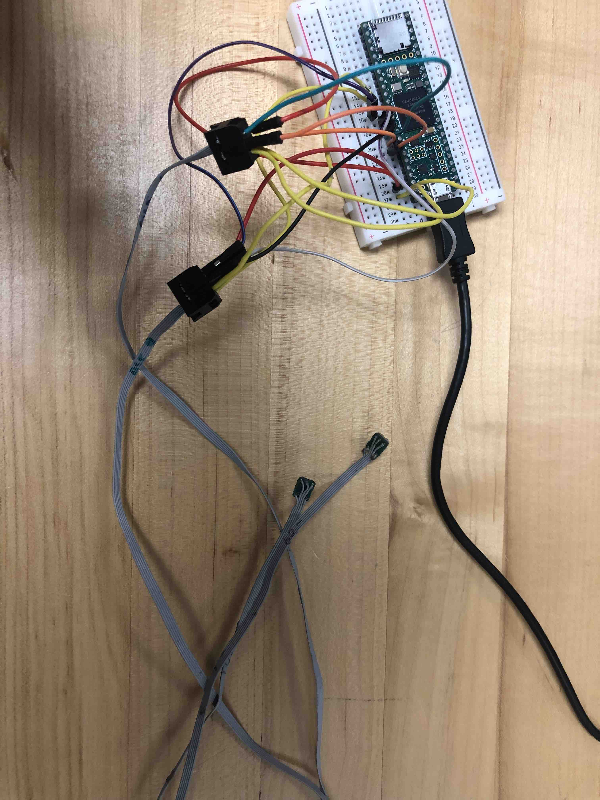
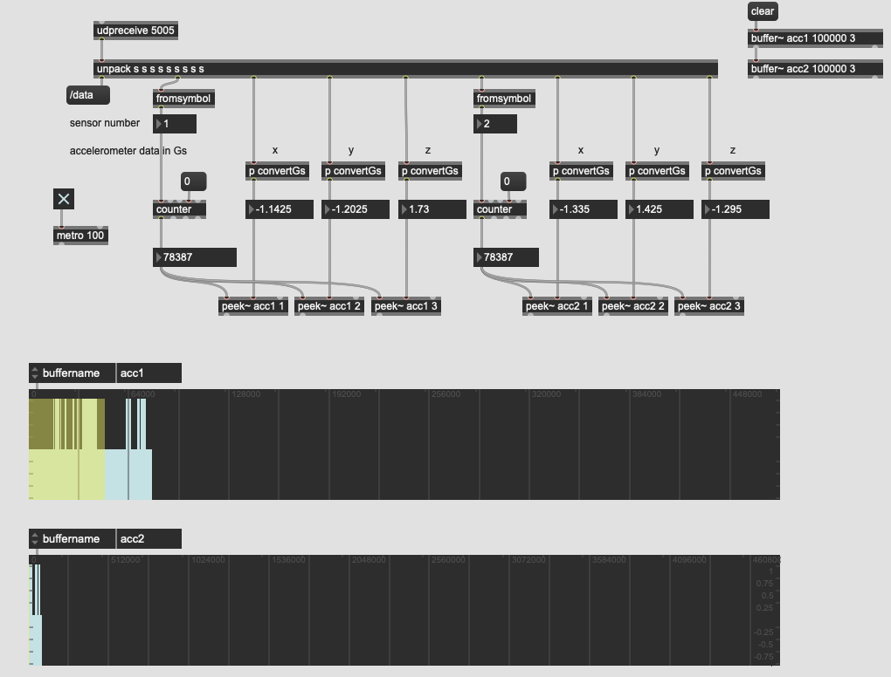
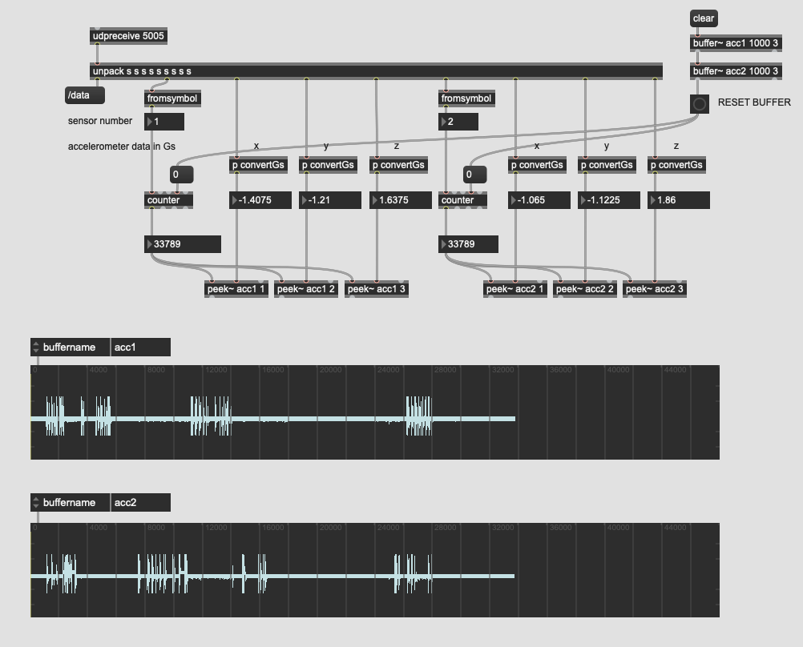
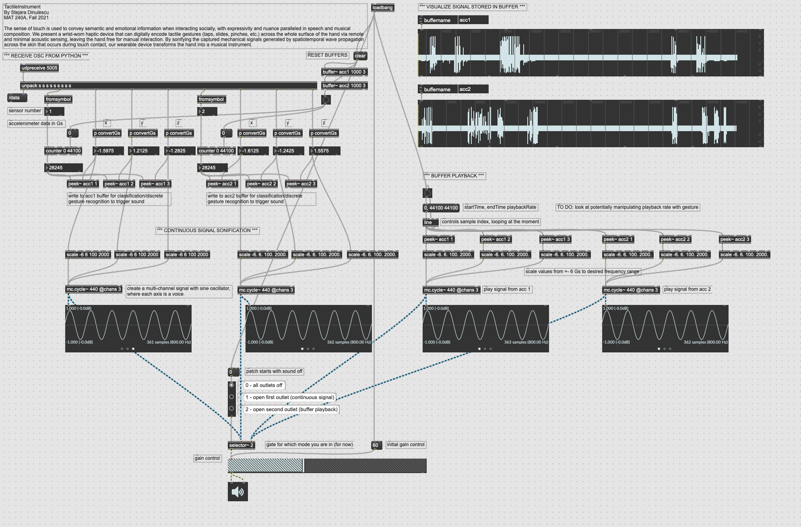

# Tactile Instrument
A haptic bracelet for turning the hand into an instrument, performed via touch.

Stejara Dinulescu, Fall 2021. MAT240A Final Project.

## Abstract

The sense of touch is used to convey semantic and emotional information when interacting socially, with expressivity and nuance paralleled in speech and musical composition. We present a wrist-worn haptic device that can digitally encode tactile gestures (taps, slides, pinches, etc.) across the whole surface of the hand via remote and minimal acoustic sensing, leaving the hand free for manual interaction. By sonifying the captured mechanical signals generated by spatiotemporal wave propagation across the skin that occurs during touch contact, our wearable device transforms the hand into a musical instrument.

-----------------------

## Documentation

- *10/28*: Utilizing the current device setup (4 3-axis analog accelerometers connected to 2 Adafruit Feather M0 Wifi boards, depicted in image above), read serial input via Max's serial object. See *SerialAccelerometerInput.maxpat* and *SerialAccelerometerIn* + *Accelerometer.h* Arduino files, located in the *SerialAccelerometerIn* folder.
  
  - Following the *Communications Tutorial 2: Serial Communication* Max tutorial, I created a max patch with the serial object, passing it the port that the adafruit device was connected to in the Arduino IDE.
  - I was successful reading in numbers from the microcontroller, but the string that I was sending serially via Arduino was not being parsed properly on the other end. I looked into the itoa and fromsymbol object in the tutorial and other references, and I found that itoa did what I needed. However, the chunking parameter was making parsing difficult, so I ended up changing the way I was sending values serially via Aruidno and using the fromsymbol object.
  - However, halfway through my creation/exploration of this patch, my devices stopped registering in the ports list of Arduino. Both Feather M0 boards were not being listed on either my Macbook or my Windows 10 office computer, despite manually resetting the board. Stack overflow or adafruit forums were not fruitful. 
    - --> Updating my Macbook fixed this issue (still using the Teensy moving forward)
    - I also found other cables with data flow that allowed me to connect the microcontroller to computer. Maybe the cables that I was previously using broke, but this seems relatively unlikely. 
  - In the meantime, I ordered a Teensy board to attempt to utilize it as a midi input. Arrives on 11/01.
  
- Utilize Teensy to transmit accelerometer data to Max (11/01-11/03). Setup pictured below with 2 accelerometers.
  
  
  
  - Get Teensy registered by computer (works now on Mac and Windows) as a midi or HI device, and/or via serial port in Arduino
    - A macOS update (to the new Monterey OS) fixed the problem I was having with the teensy not being recognized (or any microcontroller device) via USB port
  - Receive messages in Max
  - Display raw accelerometer data (x, y, z data per accelerometers --> 2 accelerometers --> 6 floats per read sample) in Max
    - Issue --> Sample drops due to needing to bang the serial object to read from serial port. Move back to old Python script for reading serial input, and send OSC data to Max.
  - OSC messaging from python script to max works (11/03 -11/04) --> I am filling a buffer with the samples read in via OSC; however, I am still experiencing sample drops. This causes the buffer to look like discrete signals (i.e. measuring periods of touch on the accelerometer, or no touch).
  - 11/06 --> I just needed to change some parameters of the buffer object to visualize the signal better. Now, you can clearly see when each accelerometer is tapped, as well as the resulting mechanical reverberations. This can now be sonified! 
  
- Sonifying signals/controlling continuous and discrete synthesis processes

  - Using line~ and mc.play~, I am able to playback all three channels of signal from each recorded buffer (11/07). This is a discrete playback method, which will be used for gesture detection and playback/control.
  - How can accelerometer signals drive/shape continuous audio output? First, I tried with a simple sine oscillator, varying pitch with signal change (11/07-11/08).
  - 11/10: I can successfully sonify signals continuously (as the accelerometers detect motion), as well as playback from a buffer discretely. 3-axis signals are normalized and mapped to a desired frequency range. Using mc.cycle~ object to treat each axis as a "voice", combining them all in the output. Will look into varying sonic properties with each accelerometer channel for more complex voices. 
  - 11/15-16: how can I introduce silence into the system? There should be no sound when there is no touch contact. 
    - Capturing values for the "zero" position -- i.e. when hand is flat and out, ready for touch contact
    - Incoming sample values are subtracted from the zero value to get a relative change in accelerometer readings
    - This change is then sonified -> this works, however, slight movements trigger sound. (Karl's recommendation -- use a continuous "zero" mapping as the hand changes, as well as a threshold for when to sound)
  - 11/15-16: how to sonify taps on the hand as impulses? I need an envelope control that is triggered upon touch contact (Karl's suggestion -- onset detection to trigger envelope)
    - 11/17-18: onset detection implementation from in-class example (Music Visualizer)

----------------

## To Dos

- *Next:* Control continuous synthesis processes
  - envelope triggering when touch contact is detected
  - silence in the system
  - better mappings for frequency modulation

- *Next:* Gesture detection with discrete buffer playback. 
  - Extend patch to capture a detected gesture
  - Compress axes to one-dimensional signal, normalize, whiten (over the entire gesture) 
  - Visualize a discrete gesture (*scope~*, *number~*)

